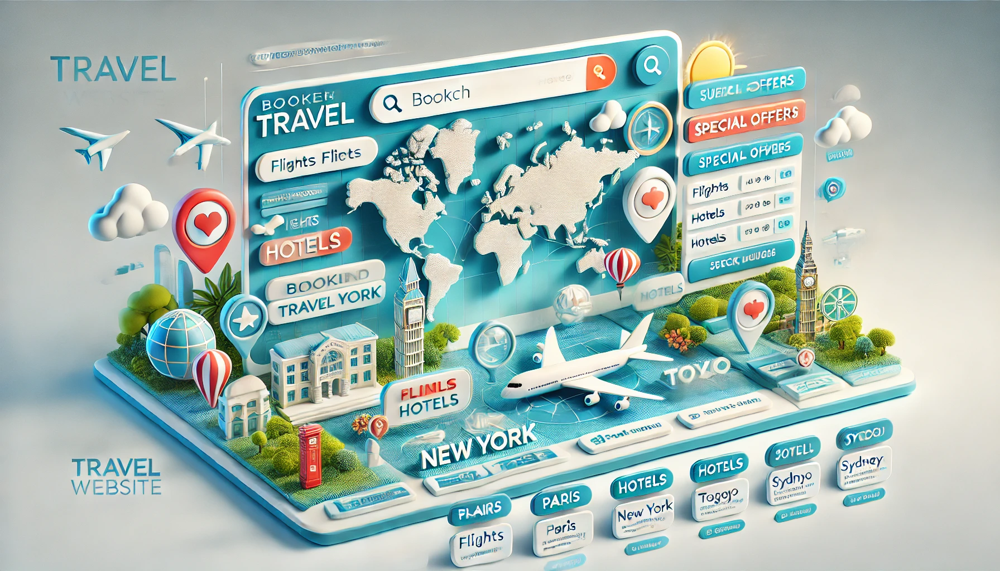

# Travel Website


[](https://developer.mozilla.org/en-US/docs/Web/Guide/HTML/HTML5)


## Project Overview

The Travel Website project is designed to offer users an interactive platform where they can explore and book travel experiences. The site caters to travelers looking for package tours, hotel bookings, and local attractions. The intuitive design enhances user engagement, making travel planning straightforward and enjoyable.




## Technologies Used

**React.js**: Used for building the user interface, providing a seamless and responsive client-side experience.

**HTML5**:: Used for structuring the web application and managing the DOM

**CSS**: Utilized for styling components, ensuring the website is visually appealing and functions well on various devices.

**JavaScript**: Powers the dynamic aspects of the website, including interactive elements like buttons and forms.


## Features

### Dynamic Package Tours Listing

**Component Structure**: Uses CardItem components within a Cards container to dynamically list available tours.

**Data Fetching**: Potential integration with a backend API to fetch the latest travel packages and render them in real-time.

**User Interaction**: Cards are designed to be interactive, allowing users to click through for more details, driven by React's state management to handle user interactions efficiently.


### Responsive Website

**Responsive Design**: CSS and JavaScript are used to ensure the navigation bar adjusts according to device size, improving usability on mobile devices.

**Dynamic Visibility**: Incorporates JavaScript to toggle visibility based on user scroll, enhancing the user experience and accessibility.

### User Authentication and Management 

**Session Management**: Potential use of session storage to manage user sessions after logging in or signing up.

**Security Measures**: Implementation of security best practices such as secure password handling and data validation on the client side.

### Booking Interface

**Form Handling**: Utilizes React's controlled components to handle forms, enabling real-time validation and feedback.

**Integration with Payment Gateways**: Could integrate with APIs like Stripe or PayPal for processing payments securely.


## Available Scripts

In the project directory, you can run:

```
npm start
```

Runs the app in the development mode.\
Open [http://localhost:3000](http://localhost:3000) to view it in your browser.

The page will reload when you make changes.\
You may also see any lint errors in the console.


```
npm test
```

Launches the test runner in the interactive watch mode.\
See the section about [running tests](https://facebook.github.io/create-react-app/docs/running-tests) for more information.


```
npm run build
```

Builds the app for production to the `build` folder.\
It correctly bundles React in production mode and optimizes the build for the best performance.

The build is minified and the filenames include the hashes.\
Your app is ready to be deployed!

See the section about [deployment](https://facebook.github.io/create-react-app/docs/deployment) for more information.


## Conclusion

The Travel Website project leverages modern web technologies to create a robust and user-friendly platform for travelers worldwide. With features like dynamic content rendering and responsive design, it stands out as an efficient tool for planning and booking travels. Future enhancements could include more personalized content delivery and improved backend integration for handling large datasets efficiently.